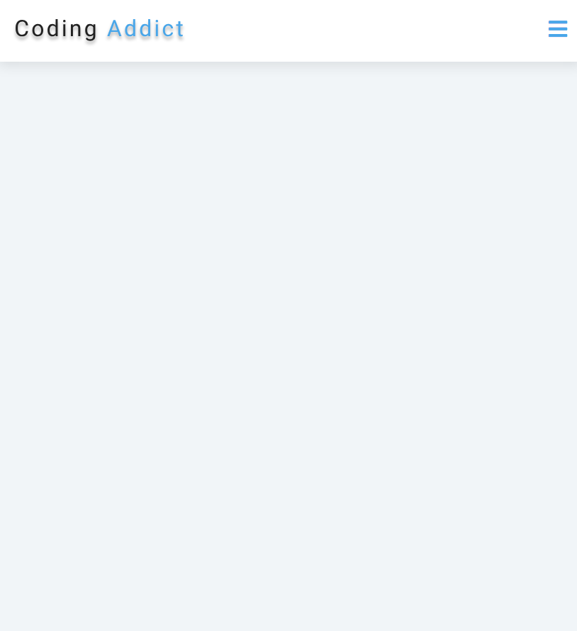
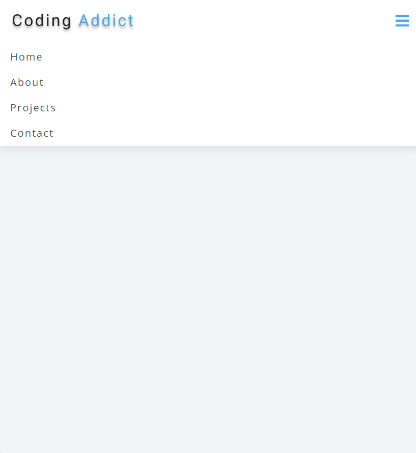

# Navbar Project

This project is a basic HTML/CSS/JavaScript project that implements a responsive navbar. The main goal of this project is to understand the addition, deletion, or toggling of classes using JavaScript.

## Project Structure

The project consists of the following files:

- `index.html`: This file contains the HTML structure of the navbar.
- `styles.css`: This file contains the styles for the navbar.
- `app.js`: This file contains the JavaScript code for adding interactivity to the navbar.

## JavaScript logic

The `app.js` file adds interactivity to the navbar. It targets the navigation toggle button and links elements and toggles a CSS class (`show-links`) on the links element when the toggle button is clicked. This class controls the visibility of the links, making them appear or disappear depending on their current state.

The JavaScript code utilizes the `classList` property to add, remove, or toggle classes dynamically based on user interaction.

## Working demo

